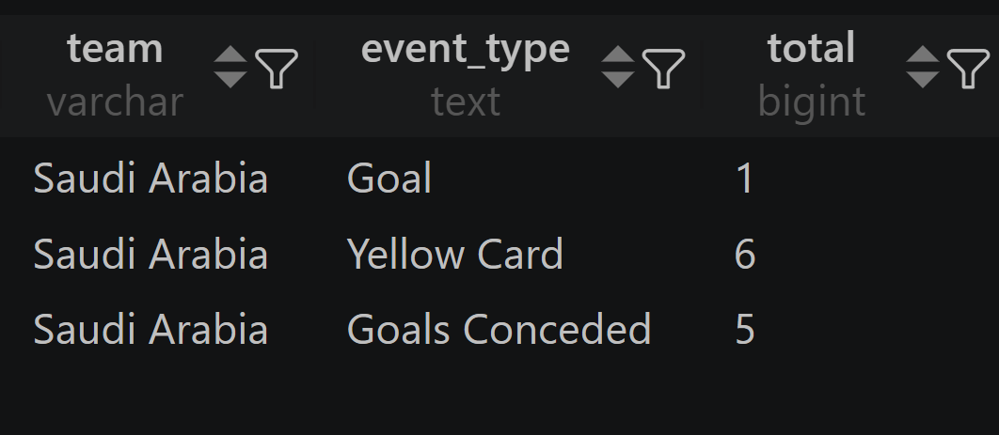

# تحليل بيانات المنتخب السعودي - كأس العالم

## الملفات
- `sql/01_team_stats.sql` — إحصائيات الفريق العامة
- `sql/02_events_analysis.sql` — تحليل الأحداث والأهداف

## النتائج

## المصدر
https://www.kaggle.com/datasets/mominullptr/fifa-world-cup-2026-dataset
